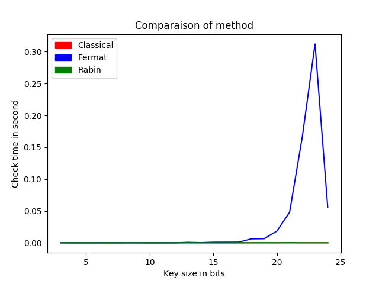

# RSA

A simple Python implementation of the RSA cipher.
 
Specifications (TODO list) :

- [ ] Key generation with correct entropy
  - [X] Naive
  - [ ] Optimized
  - [ ] Format of output keys

- [ ] Encryption/Decryption
  - [ ] Blocks
  - [ ] Optimized
  - [ ] Format of input
  - [ ] raw text
  - [ ] big files
 
This is a test

If you have ideas, please complete this TODO list.

## Fermat result

Here is a small plot about the Fermat test computation speed.

